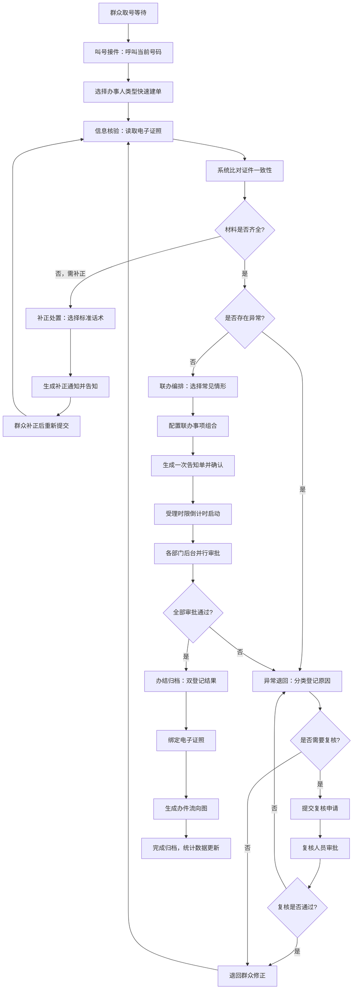

## 1. 产品概述

面向政务服务中心综合受理窗口的"出生一件事"联办桌面端工作台，将公安（出生登记）、人社（社保卡）、医保（参保登记）、卫健（出生医学证明）等分散环节的受理动作集中处理，实现"一次告知、一表申请、一套材料、一窗受理"。

- 核心目标：规范窗口受理流程、减少窗口解释成本、提升群众办事体验
- 目标用户：大厅综合窗口人员、专区专窗人员、后台审批协同人员

---

## 2. 核心功能

### 2.1 用户角色

| 角色 | 说明 | 核心权限 |
|------|------|----------|
| 综合窗口人员 | 大厅综合受理窗口 | 叫号接件、信息核验、联办编排、补正处置、办结归档 |
| 专区专窗人员 | 出生登记专区窗口 | 全部受理功能、特殊情形提交复核 |
| 后台审批人员 | 各部门后台审批 | 异常退回、复核审批、办件流向查看 |
| 窗口主管 | 窗口管理岗位 | 日办件统计、高频退件原因汇总、权限管理 |

### 2.2 功能模块

1. **叫号接件模块**：叫号信息展示、按办事人类型快速建单、办事人信息录入、历史办件查询
2. **信息核验模块**：出生医学证明电子信息读取、父母身份证OCR识别、证件一致性自动比对、缺失材料标红
3. **联办编排模块**：常见情形选择式受理、联办事项组合配置、跨事项一次告知单生成、受理时限提醒
4. **补正处置模块**：补正意见标准话术库、补正材料清单生成、补正期限设置、补正通知打印
5. **异常退回模块**：异常情形分类、退回原因选择、退件流转记录、特殊情形提交复核
6. **办结归档模块**：办件结果双登记（纸质+电子）、归档材料清单、办件流向可视化、电子证照关联

### 2.3 页面详情

| 页面名称 | 模块名称 | 功能描述 |
|----------|----------|----------|
| 工作台首页 | 顶部导航栏 | 窗口号、当前用户、待办数、时限预警、日期时间 |
| 工作台首页 | 左侧模块菜单 | 6大模块快速切换、模块状态徽章 |
| 工作台首页 | 叫号接件区 | 当前叫号队列、叫号详情、快速建单表单、办事人类型选择 |
| 工作台首页 | 信息核验区 | 电子证照读取、证件比对结果、材料清单校验、缺失标红提示 |
| 工作台首页 | 联办编排区 | 情形选择面板、事项组合配置、一次告知单预览、受理倒计时 |
| 工作台首页 | 补正处置区 | 补正话术选择器、材料补正清单、补正通知生成、历史补正记录 |
| 工作台首页 | 异常退回区 | 异常分类列表、退回原因模板、复核提交流程、退件跟踪 |
| 工作台首页 | 办结归档区 | 办结结果登记、归档材料上传、办件流向图、电子证照绑定 |
| 工作台首页 | 统计面板 | 日办件统计图表、高频退件原因汇总、办理时效分析 |

---

## 3. 核心流程

### 3.1 主流程描述

办事群众到达窗口取号后，窗口人员通过叫号接件模块呼叫当前号码，核对办事人类型（新生儿父母、监护人、委托代理人）快速建单；进入信息核验模块自动读取出生医学证明电子信息、识别父母身份证，系统自动比对证件信息一致性并标红缺失材料；通过联办编排模块根据常见情形选择需联办的事项组合，系统自动生成跨事项一次告知单并开始受理时限倒计时；如需补正则进入补正处置模块，选择标准话术生成补正通知；发现异常情形时进入异常退回模块，分类登记并可提交复核；所有事项完成后进入办结归档模块，完成纸质与电子结果双登记并归档，同时可视化展示办件流向。

### 3.2 核心流程 Mermaid 图

---

## 4. 用户界面设计

### 4.1 设计风格

**政务专业稳重风格**：
- **主色调**：政务蓝 `#1E40AF`（深邃蓝）、辅助蓝 `#3B82F6`
- **强调色**：成功绿 `#059669`、警告橙 `#D97706`、错误红 `#DC2626`、信息紫 `#7C3AED`
- **中性色**：浅灰背景 `#F1F5F9`、卡片白 `#FFFFFF`、深文字 `#0F172A`、次要文字 `#475569`
- **按钮风格**：直角微圆角（4px）、扁平化、重要操作带细边框、悬停有微妙投影
- **字体**：思源黑体（Source Han Sans CN）+ Noto Sans SC 双字体栈，标题字号 18-24px，正文 13-14px，数据显示 12px 等宽
- **布局风格**：三栏式桌面布局（左侧导航+中间主工作区+右侧信息面板），卡片化模块分区，清晰的边框分隔
- **图标风格**：线性图标（stroke-width 1.5px），政务场景专属图标（公章、证件、档案等），颜色与模块主题色对应

### 4.2 页面设计概览

| 页面名称 | 模块名称 | UI 元素 |
|----------|----------|---------|
| 工作台首页 | 顶部状态栏 | 窗口号标签、用户头像、待办数徽章、时限预警闪烁、实时时钟、快捷搜索 |
| 工作台首页 | 左侧导航 | 垂直6大模块图标+文字、当前模块高亮、未读数字徽章、模块状态指示灯 |
| 工作台首页 | 叫号接件卡片 | 叫号队列列表（大号序号+状态色条）、办事人信息表单（分栏布局）、类型切换标签页、快速操作按钮组 |
| 工作台首页 | 信息核验卡片 | 证照读取进度条、证件比对对照表（双栏并列）、材料清单勾选（缺失项红底感叹号）、核验状态印章图标 |
| 工作台首页 | 联办编排卡片 | 情形选择标签组（胶囊式）、事项组合矩阵（多选卡片）、告知单预览面板（分栏+水印）、受理倒计时环形进度 |
| 工作台首页 | 补正处置卡片 | 话术分类折叠面板、话术一键插入、补正清单表格（优先级标签）、通知模板预览（模拟纸张效果） |
| 工作台首页 | 异常退回卡片 | 异常分类图标列表、原因模板选择器（带统计热度）、复核流程时间线、流转状态标签 |
| 工作台首页 | 办结归档卡片 | 双登记切换（纸质/电子标签）、材料上传缩略图列表、办件流向桑基图、电子证照二维码 |
| 工作台首页 | 统计仪表盘 | 日办件柱状图+趋势线、退件原因饼图、时效箱线图、排名列表（带奖牌图标） |

### 4.3 响应式

- **设计原则**：桌面端优先（Desktop-first），最小适配宽度 1366px，推荐 1920px 及以上
- **窗口缩放**：1280px-1920px 自适应布局，>1920px 内容居中最大宽度限制
- **分屏支持**：支持 1:1 分屏模式（左右双窗口各显示一个模块）
- **触控优化**：按钮最小点击区域 44x44px，重要操作间距 ≥ 12px，适配触屏一体机

---

## 5. 特殊交互说明

### 5.1 微动画
- 叫号声音提示 + 号码卡片滑入动画（from top + 弹簧效果）
- 缺失材料标红时脉冲闪烁动画（3次后持续高亮）
- 受理倒计时最后5分钟黄色警告、最后1分钟红色闪烁
- 办件流向节点激活时发光涟漪效果
- 一次告知单生成时纸张翻转动画

### 5.2 快捷键
- `F5`：刷新当前叫号队列
- `Ctrl+S`：快速保存当前办件
- `Ctrl+P`：打印告知单/补正通知
- `Ctrl+1~6`：快速切换6大模块
- `Esc`：取消当前操作/关闭弹窗

### 5.3 数据可视化
- 办件流向使用桑基图（Sankey Diagram）展示各环节流转量
- 日办件统计使用堆叠柱状图区分不同办事人类型
- 高频退件原因使用饼图+词云双重展示
- 受理时限使用热力图展示各时段办理压力
