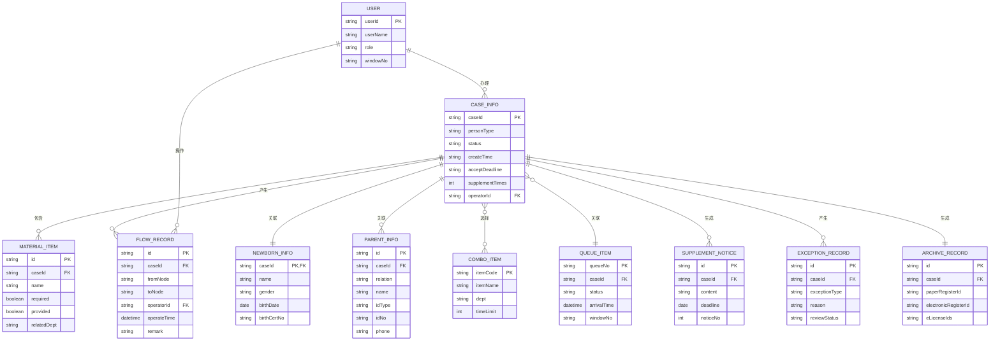

## 1. 架构设计

```mermaid
graph TB
    subgraph "用户层"
        U1["综合窗口人员"]
        U2["专区专窗人员"]
        U3["后台审批人员"]
        U4["窗口主管"]
    end

    subgraph "前端展示层 React + Vite"
        direction TB
        V1["顶部状态栏 HeaderBar"]
        V2["左侧导航 SideNav"]
        V3["叫号接件模块 CallReceive"]
        V4["信息核验模块 InfoVerify"]
        V5["联办编排模块 ComboArrange"]
        V6["补正处置模块 Supplement"]
        V7["异常退回模块 ExceptionReturn"]
        V8["办结归档模块 Archive"]
        V9["统计仪表盘 Dashboard"]
    end

    subgraph "状态管理层 Context + Hooks"
        S1["办件全局状态 CaseContext"]
        S2["用户权限状态 AuthContext"]
        S3["叫号队列状态 QueueContext"]
        S4["通知消息状态 NotifyContext"]
    end

    subgraph "业务逻辑层 Service"
        B1["叫号服务 QueueService"]
        B2["证照核验服务 VerifyService"]
        B3["联办编排服务 ComboService"]
        B4["补正通知服务 SupplementService"]
        B5["异常退件服务 ExceptionService"]
        B6["归档服务 ArchiveService"]
        B7["统计分析服务 StatsService"]
    end

    subgraph "数据层 Mock + LocalStorage"
        D1["模拟数据 MockData"]
        D2["本地缓存 LocalStorage"]
        D3["静态配置 Config"]
        D4["标准话术库 ScriptsLib"]
    end

    subgraph "外部服务模拟层"
        E1["公安户籍系统模拟"]
        E2["人社社保系统模拟"]
        E3["医保参保系统模拟"]
        E4["卫健出生证系统模拟"]
        E5["电子证照平台模拟"]
    end

    U1 & U2 & U3 & U4 --> V1 & V2
    V3 & V4 & V5 & V6 & V7 & V8 & V9 --> S1 & S2 & S3 & S4
    S1 & S2 & S3 & S4 --> B1 & B2 & B3 & B4 & B5 & B6 & B7
    B1 & B2 & B3 & B4 & B5 & B6 & B7 --> D1 & D2 & D3 & D4
    B2 & B3 & B6 --> E1 & E2 & E3 & E4 & E5
```



---

## 2. 技术选型说明

| 技术领域 | 技术栈 | 版本 | 说明 |
|----------|--------|------|------|
| 前端框架 | React | 18.x | 函数组件 + Hooks 开发模式 |
| 构建工具 | Vite | 5.x | 快速冷启动、HMR 热更新 |
| 语言 | TypeScript | 5.x | 类型安全，提升代码可维护性 |
| 样式方案 | Tailwind CSS | 3.x | 原子化 CSS 工具类，快速构建界面 |
| UI 组件库 | Ant Design | 5.x | 企业级中后台组件库，适配政务场景 |
| 状态管理 | React Context + Hooks | - | 轻量状态管理，避免过度设计 |
| 数据可视化 | ECharts | 5.x | 桑基图、饼图、柱状图等丰富图表 |
| 图标库 | @ant-design/icons | 5.x | 线性图标库，与 AntD 风格统一 |
| 日期处理 | dayjs | 1.x | 轻量级日期处理库 |
| 唯一标识 | uuid | 9.x | 生成办件编号等唯一ID |
| 模拟数据 | Mock.js + 手写数据 | - | 模拟后端接口响应 |

---

## 3. 项目目录结构

```
出生一件事联办工作台/
├── src/
│   ├── assets/                  # 静态资源
│   │   ├── images/              # 图片资源
│   │   └── styles/              # 全局样式
│   │       └── globals.css      # 全局 CSS + Tailwind 入口
│   ├── components/              # 可复用组件
│   │   ├── layout/              # 布局组件
│   │   │   ├── HeaderBar.tsx    # 顶部状态栏
│   │   │   ├── SideNav.tsx      # 左侧导航
│   │   │   └── PageLayout.tsx   # 页面容器
│   │   ├── common/              # 通用组件
│   │   │   ├── StatusBadge.tsx  # 状态徽章
│   │   │   ├── TimerAlert.tsx   # 时限提醒
│   │   │   ├── MaterialCheck.tsx # 材料清单
│   │   │   └── StampIcon.tsx    # 印章图标
│   │   └── charts/              # 图表组件
│   │       ├── SankeyFlow.tsx   # 办件流向桑基图
│   │       ├── DailyStats.tsx   # 日办件统计图
│   │       └── ReasonPie.tsx    # 退件原因饼图
│   ├── modules/                 # 6大业务模块
│   │   ├── CallReceive/         # 叫号接件
│   │   │   ├── index.tsx
│   │   │   ├── QueueList.tsx    # 叫号队列
│   │   │   ├── QuickCreate.tsx  # 快速建单
│   │   │   └── PersonTypeTabs.tsx # 办事人类型
│   │   ├── InfoVerify/          # 信息核验
│   │   │   ├── index.tsx
│   │   │   ├── CertReader.tsx   # 证照读取
│   │   │   ├── CompareTable.tsx # 证件比对表
│   │   │   └── VerifyResult.tsx # 核验结果
│   │   ├── ComboArrange/        # 联办编排
│   │   │   ├── index.tsx
│   │   │   ├── SceneSelector.tsx # 情形选择器
│   │   │   ├── ItemMatrix.tsx   # 事项组合矩阵
│   │   │   ├── NoticePreview.tsx # 告知单预览
│   │   │   └── CountdownTimer.tsx # 受理倒计时
│   │   ├── Supplement/          # 补正处置
│   │   │   ├── index.tsx
│   │   │   ├── ScriptLibrary.tsx # 话术库
│   │   │   ├── SupplementList.tsx # 补正清单
│   │   │   └── NoticeGenerator.tsx # 补正通知生成
│   │   ├── ExceptionReturn/     # 异常退回
│   │   │   ├── index.tsx
│   │   │   ├── ExceptionTypes.tsx # 异常分类
│   │   │   ├── ReasonTemplates.tsx # 退回原因模板
│   │   │   ├── ReviewSubmit.tsx # 复核提交
│   │   │   └── ReturnTimeline.tsx # 流转时间线
│   │   └── Archive/             # 办结归档
│   │       ├── index.tsx
│   │       ├── DualRegister.tsx # 双登记切换
│   │       ├── MaterialUpload.tsx # 归档材料上传
│   │       ├── FlowVisualize.tsx # 流向可视化
│   │       └── ELicenseBind.tsx # 电子证照绑定
│   ├── context/                 # 全局状态
│   │   ├── CaseContext.tsx      # 办件状态
│   │   ├── AuthContext.tsx      # 用户权限
│   │   ├── QueueContext.tsx     # 叫号队列
│   │   └── NotifyContext.tsx    # 通知消息
│   ├── services/                # 业务服务层
│   │   ├── QueueService.ts
│   │   ├── VerifyService.ts
│   │   ├── ComboService.ts
│   │   ├── SupplementService.ts
│   │   ├── ExceptionService.ts
│   │   ├── ArchiveService.ts
│   │   └── StatsService.ts
│   ├── data/                    # 数据层
│   │   ├── mock/                # 模拟数据
│   │   │   ├── queueData.ts
│   │   │   ├── caseData.ts
│   │   │   ├── materialData.ts
│   │   │   └── statsData.ts
│   │   ├── config/              # 静态配置
│   │   │   ├── moduleConfig.ts  # 模块配置
│   │   │   ├── sceneConfig.ts   # 情形配置
│   │   │   └── exceptionConfig.ts # 异常配置
│   │   └── libraries/           # 标准库
│   │       └── supplementScripts.ts # 补正话术库
│   ├── types/                   # TypeScript 类型定义
│   │   ├── case.ts              # 办件相关类型
│   │   ├── queue.ts             # 叫号相关类型
│   │   ├── material.ts          # 材料相关类型
│   │   └── user.ts              # 用户相关类型
│   ├── utils/                   # 工具函数
│   │   ├── dateUtils.ts
│   │   ├── idGenerator.ts
│   │   └── validator.ts
│   ├── App.tsx                  # 根组件
│   └── main.tsx                 # 入口文件
├── public/
│   └── favicon.ico
├── index.html
├── package.json
├── vite.config.ts
├── tsconfig.json
├── tailwind.config.js
└── postcss.config.js
```

---

## 4. 路由定义

| 路由 | 页面用途 | 对应模块 |
|------|----------|----------|
| `/` | 工作台首页（默认跳转叫号接件） | - |
| `/call-receive` | 叫号接件模块 | CallReceive |
| `/info-verify` | 信息核验模块 | InfoVerify |
| `/combo-arrange` | 联办编排模块 | ComboArrange |
| `/supplement` | 补正处置模块 | Supplement |
| `/exception-return` | 异常退回模块 | ExceptionReturn |
| `/archive` | 办结归档模块 | Archive |
| `/dashboard` | 统计仪表盘 | Dashboard |

**路由实现**：使用 React Router v6，采用嵌套路由结构，所有业务路由嵌套在 PageLayout 下。

---

## 5. 核心类型定义（TypeScript）

### 5.1 办件类型定义

```typescript
// 办事人类型枚举
export type PersonType = 'PARENTS' | 'GUARDIAN' | 'AGENT';

// 办件状态枚举
export type CaseStatus = 
  | 'QUEUING'      // 排队中
  | 'CREATED'      // 已建单
  | 'VERIFYING'    // 核验中
  | 'VERIFY_PASS'  // 核验通过
  | 'SUPPLEMENT'   // 待补正
  | 'EXCEPTION'    // 异常
  | 'PROCESSING'   // 办理中
  | 'REVIEWING'    // 复核中
  | 'COMPLETED'    // 已办结
  | 'ARCHIVED';    // 已归档

// 新生儿信息
export interface NewbornInfo {
  name: string;                    // 姓名
  gender: 'MALE' | 'FEMALE';       // 性别
  birthDate: string;               // 出生日期
  birthPlace: string;              // 出生地点
  healthStatus: string;            // 健康状况
  birthCertNo: string;             // 出生医学证明编号
}

// 父母/监护人信息
export interface ParentInfo {
  relation: 'FATHER' | 'MOTHER' | 'GUARDIAN' | 'AGENT';
  name: string;
  idType: string;                  // 证件类型
  idNo: string;                    // 证件号码
  phone: string;                   // 联系电话
  address: string;                 // 户籍地址
}

// 联办事项枚举
export type ComboItem = 
  | 'BIRTH_REGISTER'     // 出生登记（公安）
  | 'SOCIAL_SECURITY'    // 社保卡办理（人社）
  | 'MEDICAL_INSURANCE'  // 医保参保登记（医保）
  | 'PREVENTION_CARD'    // 预防接种证（卫健）
  | 'MATERNITY_BENEFIT'; // 生育待遇申领（医保/人社）

// 材料清单项
export interface MaterialItem {
  id: string;
  name: string;           // 材料名称
  required: boolean;      // 是否必填
  provided: boolean;      // 是否已提供
  isElectronic: boolean;  // 是否电子证照
  remark?: string;        // 备注
  relatedDept: string;    // 关联部门
}

// 办件主对象
export interface CaseInfo {
  caseId: string;                    // 办件编号
  personType: PersonType;            // 办事人类型
  status: CaseStatus;                // 办件状态
  newborn: NewbornInfo;              // 新生儿信息
  parents: ParentInfo[];             // 父母/监护人列表
  selectedItems: ComboItem[];        // 已选联办事项
  materials: MaterialItem[];         // 材料清单
  sceneType?: string;                // 情形类型
  createTime: string;                // 创建时间
  acceptDeadline?: string;           // 受理截止时间
  supplementTimes: number;           // 补正次数
  flowRecords: FlowRecord[];         // 流转记录
}

// 流转记录
export interface FlowRecord {
  id: string;
  fromNode: string;
  toNode: string;
  operator: string;
  operateTime: string;
  remark: string;
}
```

### 5.2 叫号队列类型

```typescript
export interface QueueItem {
  queueNo: string;           // 排队号（如 A001）
  caseId?: string;           // 关联办件ID
  personType: PersonType;
  applicantName: string;
  newbornName?: string;
  arrivalTime: string;       // 取号时间
  callTime?: string;         // 呼叫时间
  waitDuration: number;      // 等待时长（分钟）
  status: 'WAITING' | 'CALLING' | 'PROCESSING' | 'DONE' | 'PASSED';
  windowNo?: string;         // 办理窗口
}
```

### 5.3 统计数据类型

```typescript
export interface DailyStats {
  date: string;
  totalCases: number;        // 总办件数
  byPersonType: {
    parents: number;
    guardian: number;
    agent: number;
  };
  completed: number;         // 已办结
  supplement: number;        // 补正数
  exception: number;         // 异常数
  avgDuration: number;       // 平均办理时长（分钟）
}

export interface ReturnReasonStat {
  reason: string;
  count: number;
  percentage: number;
}
```

---

## 6. 数据模型 ER 图



---

## 7. 性能优化与安全

### 7.1 性能优化

- **代码分割**：按业务模块进行动态 import 懒加载
- **组件优化**：使用 React.memo、useMemo、useCallback 避免不必要渲染
- **虚拟列表**：叫号队列、材料清单等长列表采用虚拟滚动
- **请求缓存**：配置项、话术库等静态数据一次性加载并缓存
- **防抖节流**：搜索框、实时校验等输入场景采用防抖

### 7.2 安全考量

- **敏感信息脱敏**：身份证号、手机号等个人信息界面展示脱敏处理
- **本地数据加密**：LocalStorage 存储办件信息时采用 AES 加密
- **操作日志**：所有关键操作（建单、退回、归档）记录操作日志
- **权限控制**：基于角色的菜单和按钮级权限控制
- **打印水印**：告知单、补正通知等打印件添加窗口号和时间水印
